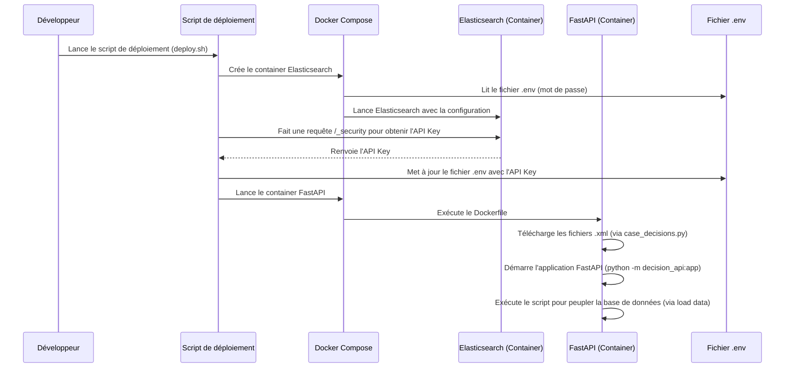
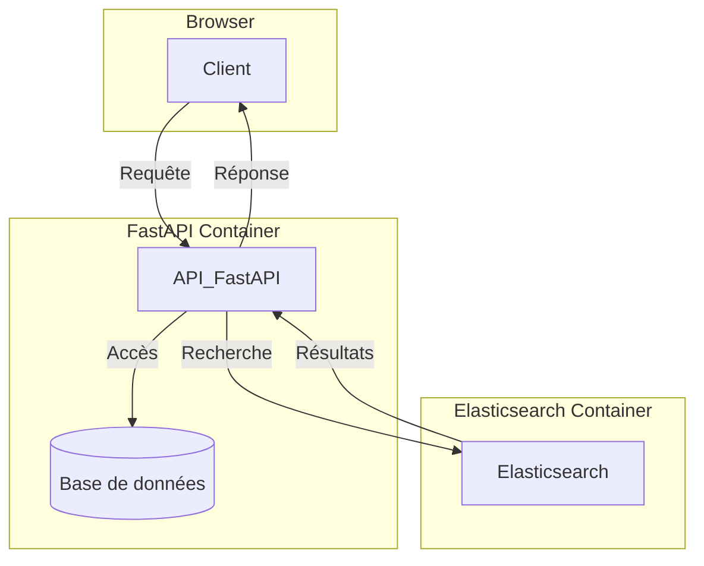

# Résumé de la résolution du problème : Exposition des décisions de la cour de cassation

## Sujet
La Cour de cassation fournit une partie de ses décisions via le dépôt [OPENDATA CASS](https://echanges.dila.gouv.fr/OPENDATA/CASS/). Ce dépôt contient des archives avec des fichiers XML, chacun correspondant à une décision rendue par la cour.

## Étape 1 : Récupération des décisions
Un script a été développé pour :
- **Télécharger les fichiers XML** depuis le dépôt.
- **Parser** ces fichiers XML pour extraire les décisions.
- **Stocker** les décisions dans une base de données pour une utilisation ultérieure.

## Étape 2 : Mise en place d'une API REST
Une API REST a été créée pour exposer les décisions avec les fonctionnalités suivantes :

### Fonctionnalités de l'API
1. **Renvoyer une liste de toutes les décisions** :
   - Affichage uniquement de l'identifiant et du titre de chaque décision.

2. **Filtrage par chambre** :
   - Possibilité de filtrer les décisions en fonction de la chambre, en utilisant le chemin suivant dans le document XML :
     ```
     FORMATION: TEXTE_JURI_JUDI > META > META_SPEC > META_JURI_JUDI > FORMATION
     ```

3. **Renvoyer le contenu d'une décision** :
   - Récupération de l'identifiant, du titre et du contenu d'une décision en fonction de son identifiant.

4. **Sécurisation de l'API** :
   - L'API est accessible uniquement avec un **login** et un **mot de passe**.

5. **Format de réponse** :
   - Les données sont renvoyées en **JSON**.

### Bonus
- Une fonctionnalité de **recherche textuelle** basique a été implémentée, permettant de retourner les décisions correspondantes triées par **score de pertinence**.

## Conclusion
Cette solution permet de récupérer, stocker et exposer efficacement les décisions de la cour de cassation via une API sécurisée, tout en offrant des fonctionnalités de filtrage et de recherche pour une meilleure accessibilité des informations juridiques.

## UML diagrams

example, this will produce a sequence diagram:



API Architecture:


